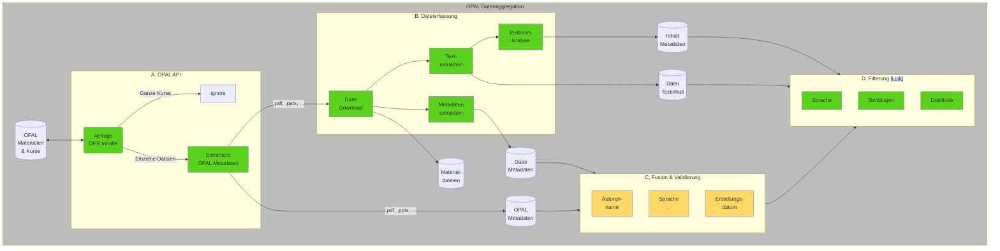
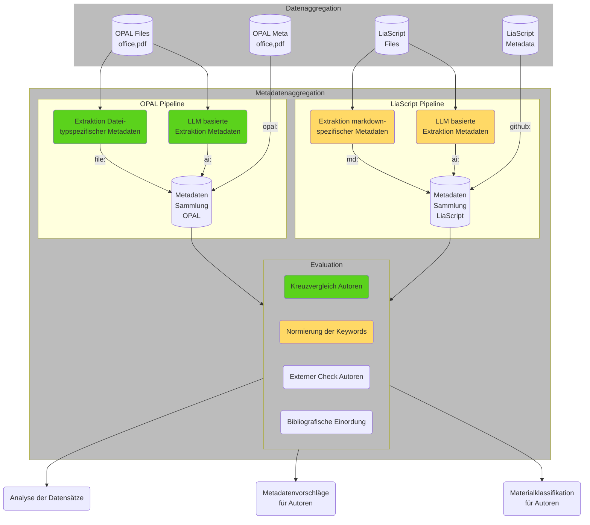

# Pipeline Umsetzung

## Zielstellung

+ automatisiertes "Auffüllen" von Metadaten für existierende OPAL Datensätze
+ Unterstützung bei der Eingabe von Metadaten während der Eingabe durch den Lehrenden
+ Identifikation von ähnlichen Inhalten

## Konzept

Die Umsetzung der einzelnen Aggregationsstufen baut auf der im Ordner `pipeline` vorgesehenen [Implemetierung](https://github.com/TUBAF-IFI-ConnectedLecturer/Data_aggregation/blob/main/pipeline/README.md) auf. 
Diese sind durch die json Konfigurationsfiles, die unter `cl_pipeline\run` für LiaScript und OPAL definiert.

Die Konfigurationsfiles bestehen aus 3 Teilen: Der erste Abschnitt legt globale Parameter zur Datenstruktur fest, die über Variablen (z.B. `RAW`) im weiteren genutzt werden können. 
Der zweite Abschnitt beschreibt die für die Pipeline bereitstehenden Implementierungen der "Stages", die von den pipeline-Klassen abgeleitet werden. 
Den dritten Abschnitt bilden dann die eigentlichen Stages oder Pipelinestufen, die wiederum lokale Variablen umfassen.


```yaml
# Defining data folder stucture
folder_structure:
  #data_root_folder: &BASE ./data
  data_root_folder: &BASE /mnt/9cd5c6a1-07f3-4580-be34-8d8dd9d6fe6d/Connected_Lecturers/Opal
  raw_data_folder: &RAW !join [*BASE, /raw]
  file_folder: &FILE_FOLDER !join [*RAW, /files]
  processed_data_folder: &PREPROCESSED !join [*BASE, /processed]

# Referencing the modules containing modules
stages_module_path:
    - ../src/general/
    - ../src/opal/

# Defining stages and parameters
stages:
  - name: Generate data folder structure
    class: ProvideDataFolders

  - name: Collect raw data from OPAL 
    class: CollectOPALOERdocuments
    parameters:
      repo_file_name: OPAL_repos.p
      file_file_name: &OPALSINGLEFILES OPAL_files.p
      json_file_name: OPAL_raw_data.json
      json_url: https://bildungsportal.sachsen.de/opal/oer/content.json
      overwrite_json: False
...
```

## Verabeitungskette und Pipelinestufen

### Schritt 1: OER Material-Aggregation und Vorverarbeitung




## Schritt 2: Metadatenextraktion und -generierung



## Generelle Installation 

+ Installation von `pipenv` als virtuelle Entwicklungsumgebung
+ Ausführen von `pipenv install` im Projektordner


### OPAL

*Vorbereitung*

+ Prüfen der Angaben der Ordnerstruktur und den internen Nutzern in `identification_opal.yaml`

*Ausführung*

``` 
pipenv shell
(pipenv) cd run
(pipenv) python run_pipeline.py -c identification_opal.yaml
```

### LiaScript 

*Vorbereitung*

+ github Account anlegen und in `.env` hinterlegen
+ Prüfen der Angaben der Ordnerstruktur und den internen Nutzern in `identification_liascript.yaml`

*Ausführung*

``` 
pipenv shell
(pipenv) cd run
(pipenv) python run_pipeline.py -c identification_liascript.yaml
```

> Wegen der API Limitierung von Github, kann es sein, dass das Auslesen der Datensätze von Github mehrere Tage dauern!
