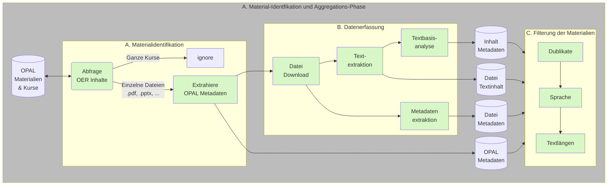
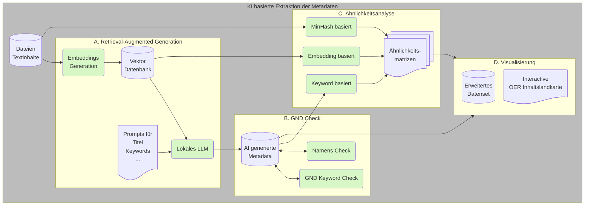

# Pipeline Umsetzung

## Zielstellung

+ automatisiertes "Auffüllen" von Metadaten für existierende OPAL Datensätze
+ Unterstützung bei der Eingabe von Metadaten während der Eingabe durch den Lehrenden
+ Identifikation von ähnlichen Inhalten

## Konzept

Die Umsetzung der einzelnen Aggregationsstufen baut auf der im Ordner `pipeline` vorgesehenen [Implemetierung](https://github.com/TUBAF-IFI-ConnectedLecturer/Data_aggregation/blob/main/pipeline/README.md) auf. 
Diese sind durch die json Konfigurationsfiles, die unter `cl_pipeline\run` für LiaScript und OPAL definiert.

Die Konfigurationsfiles bestehen aus 3 Teilen: Der erste Abschnitt legt globale Parameter zur Datenstruktur fest, die über Variablen (z.B. `RAW`) im weiteren genutzt werden können. 
Der zweite Abschnitt beschreibt die für die Pipeline bereitstehenden Implementierungen der "Stages", die von den pipeline-Klassen abgeleitet werden. 
Den dritten Abschnitt bilden dann die eigentlichen Stages oder Pipelinestufen, die wiederum lokale Variablen umfassen.


```yaml
# Defining data folder stucture
folder_structure:
  #data_root_folder: &BASE ./data
  data_root_folder: &BASE /mnt/9cd5c6a1-07f3-4580-be34-8d8dd9d6fe6d/Connected_Lecturers/Opal
  raw_data_folder: &RAW !join [*BASE, /raw]
  file_folder: &FILE_FOLDER !join [*RAW, /files]
  processed_data_folder: &PREPROCESSED !join [*BASE, /processed]

# Referencing the modules containing modules
stages_module_path:
    - ../src/general/
    - ../src/opal/

# Defining stages and parameters
stages:
  - name: Generate data folder structure
    class: ProvideDataFolders

  - name: Collect raw data from OPAL 
    class: CollectOPALOERdocuments
    parameters:
      repo_file_name: OPAL_repos.p
      file_file_name: &OPALSINGLEFILES OPAL_files.p
      json_file_name: OPAL_raw_data.json
      json_url: https://bildungsportal.sachsen.de/opal/oer/content.json
      overwrite_json: False
...
```

## Verabeitungskette und Pipelinestufen

### Schritt 1: OER Material-Aggregation und Vorverarbeitung




## Schritt 2: Metadatenextraktion und -generierung



## Installation

### Voraussetzungen

- Python 3.12
- [pipenv](https://pipenv.pypa.io/) für Dependency Management
- [Ollama](https://ollama.ai/) für lokale LLM-Nutzung (optional, je nach Pipeline)

### Installation der Dependencies

```bash
# 1. Ins cl-pipeline Verzeichnis wechseln
cd cl-pipeline

# 2. Virtual Environment erstellen und alle Dependencies installieren
pipenv install

# Dies installiert automatisch:
# - Alle Python-Pakete aus dem Pipfile
# - Das pipeline-Package als editable install
```

**Wichtig**: Es ist NICHT notwendig, `pipenv install` in mehreren Verzeichnissen auszuführen.
Das `cl-pipeline/Pipfile` verwaltet alle Dependencies und referenziert das `pipeline`-Package automatisch.

### Ollama Setup (für AI-Metadaten-Extraktion)

```bash
# Ollama installieren (siehe https://ollama.ai/)
# Benötigte Modelle herunterladen:
ollama pull llama3.3:70b    # Für Metadaten-Extraktion
ollama pull gemma3:27b      # Für Keyword-Auswahl
ollama pull jina/jina-embeddings-v2-base-de  # Für Embeddings

# Ollama Server starten
ollama serve
```

## Pipeline-Ausführung

Die Pipelines sind jetzt in einer modularen Struktur unter `cl-pipeline/run/pipelines/` organisiert:

- `arbeitsbasis/` - Verarbeitung von 6732 PDFs aus 18 Journals
- `local_pdfs/` - Lokale PDF-Verarbeitung mit wissenschaftlichen Papers
- `opal/` - OPAL OER Dokumente
- `liascript/` - LiaScript GitHub Repositories

### OPAL Pipeline

*Vorbereitung*

+ Prüfen der Konfiguration in [cl-pipeline/run/pipelines/opal/config/full.yaml](cl-pipeline/run/pipelines/opal/config/full.yaml)
+ Ordnerstruktur und Datenquellen anpassen falls nötig

*Ausführung*

```bash
cd cl-pipeline/run
pipenv run python run_pipeline.py -c pipelines/opal/config/full.yaml
```

Logs werden automatisch in `pipelines/opal/logs/` gespeichert.

Mehr Details: [cl-pipeline/run/pipelines/opal/README.md](cl-pipeline/run/pipelines/opal/README.md)

### Local PDFs Pipeline

*Vorbereitung*

+ Konfiguration prüfen: [cl-pipeline/run/pipelines/local_pdfs/config/full.yaml](cl-pipeline/run/pipelines/local_pdfs/config/full.yaml)
+ PDFs vorbereiten mit: `pipelines/local_pdfs/scripts/prepare_local_pdfs.py`

*Ausführung*

```bash
cd cl-pipeline/run
pipenv run python run_pipeline.py -c pipelines/local_pdfs/config/full.yaml
```

Mehr Details: [cl-pipeline/run/pipelines/local_pdfs/README.md](cl-pipeline/run/pipelines/local_pdfs/README.md)

### LiaScript Pipeline

*Vorbereitung*

+ GitHub Personal Access Token erstellen und in `.env` hinterlegen:
  ```bash
  # In cl-pipeline/run/.env
  GITHUB_API_KEY=your_token_here
  ```
+ Konfiguration prüfen: [cl-pipeline/run/pipelines/liascript/config/full.yaml](cl-pipeline/run/pipelines/liascript/config/full.yaml)

*Ausführung*

```bash
cd cl-pipeline/run
pipenv run python run_pipeline.py -c pipelines/liascript/config/full.yaml
```

> **Hinweis**: Wegen der API-Limitierung von GitHub kann das Auslesen der Datensätze mehrere Tage dauern!

Mehr Details: [cl-pipeline/run/pipelines/liascript/README.md](cl-pipeline/run/pipelines/liascript/README.md)

### Arbeitsbasis Pipeline

*Vorbereitung*

+ PDFs vorbereiten mit: `pipelines/local_pdfs/scripts/prepare_arbeitsbasis.py`
+ Konfiguration prüfen: [cl-pipeline/run/pipelines/arbeitsbasis/config/full.yaml](cl-pipeline/run/pipelines/arbeitsbasis/config/full.yaml)

*Ausführung*

```bash
cd cl-pipeline/run
pipenv run python run_pipeline.py -c pipelines/arbeitsbasis/config/full.yaml
```

## Projektstruktur

```
Data_aggregation/
├── cl-pipeline/           # Hauptprojekt
│   ├── Pipfile           # Dependency Management (alle Pakete)
│   ├── run/
│   │   ├── pipelines/    # Modulare Pipeline-Projekte
│   │   │   ├── arbeitsbasis/
│   │   │   ├── local_pdfs/
│   │   │   ├── opal/
│   │   │   ├── liascript/
│   │   │   └── shared/   # Gemeinsame Ressourcen
│   │   └── run_pipeline.py
│   ├── src/              # Pipeline Stage Implementierungen
│   └── stages/           # Stage-spezifische Module
└── pipeline/             # Core Pipeline Framework
    └── pipeline/         # Base Classes
```
