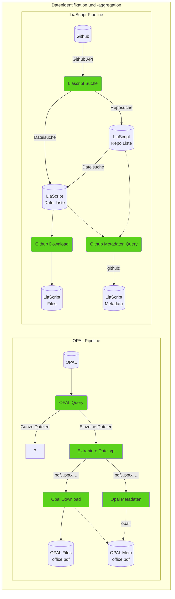

# Pipeline Umsetzung

## Konzept

Die Umsetzung der einzelnen Aggregationsstufen baut auf der im Ordner `pipeline` vorgesehenen [Implemetierung](https://github.com/TUBAF-IFI-ConnectedLecturer/Data_aggregation/blob/main/pipeline/README.md) auf. 
Diese sind durch die json Konfigurationsfiles, die unter `cl_pipeline\run` für LiaScript und OPAL definiert.

Die Konfigurationsfiles bestehen aus 3 Teilen: Der erste Abschnitt legt globale Parameter zur Datenstruktur fest, die über Variablen (z.B. `RAW`) im weiteren genutzt werden können. 
Der zweite Abschnitt beschreibt die für die Pipeline bereitstehenden Implementierungen der "Stages", die von den pipeline-Klassen abgeleitet werden. 
Den dritten Abschnitt bilden dann die eigentlichen Stages oder Pipelinestufen, die wiederum lokale Variablen umfassen.


```yaml
# Defining data folder stucture
folder_structure:
  #data_root_folder: &BASE ./data
  data_root_folder: &BASE /mnt/9cd5c6a1-07f3-4580-be34-8d8dd9d6fe6d/Connected_Lecturers/Opal
  raw_data_folder: &RAW !join [*BASE, /raw]
  file_folder: &FILE_FOLDER !join [*RAW, /files]
  processed_data_folder: &PREPROCESSED !join [*BASE, /processed]

# Referencing the modules containing modules
stages_module_path:
    - ../src/general/
    - ../src/opal/

# Defining stages and parameters
stages:
  - name: Generate data folder structure
    class: ProvideDataFolders

  - name: Collect raw data from OPAL 
    class: CollectOPALOERdocuments
    parameters:
      repo_file_name: OPAL_repos.p
      file_file_name: &OPALSINGLEFILES OPAL_files.p
      json_file_name: OPAL_raw_data.json
      json_url: https://bildungsportal.sachsen.de/opal/oer/content.json
      overwrite_json: False
...
```

## Realisierung

### Schritt 1: Datenidentifikation und -aggregation



